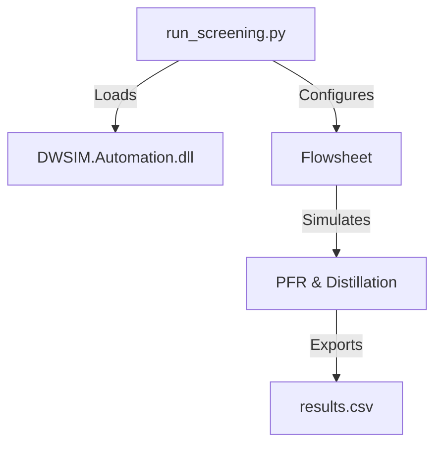

# DWSIM Automation Infrastructure


## 📖 Overview

This repository hosts the automation infrastructure for **DWSIM Process Simulations**. It orchestrates headless simulations for chemical processes, enabling parametric sweeps and high-throughput screening without manual GUI interaction.

**Core Capabilities:**
*   **Headless Execution**: Runs entirely via the DWSIM Automation API (`pythonnet`).
*   **Pipeline Orchestration**: Manages simulation lifecycle (Init -> Setup -> Solve -> Report).
*   **Resilience**: Implements robust error handling and auto-discovery of DWSIM binaries.

---

## 🏗️ Architecture & File Structure

The project follows a flat, script-based architecture designed for portability and ease of execution.



### Directory Layout

```plaintext
FOSSEE/
├── 📄 README.md              # Infrastructure documentation (this file)
├── 📄 requirements.txt       # Python dependency manifest
├── 📄 results.csv            # [Artifact] Simulation output metrics (generated)
└── 🐍 run_screening.py       # [Entrypoint] Main automation controller
```

### Component Details

| File | Type | Description |
| :--- | :--- | :--- |
| `run_screening.py` | **Controller** | Primary logic for DWSIM binding, flowsheet construction, and parametric looping. Contains `CLUSTER_API_KEY` configuration. |
| `requirements.txt` | **Manifest** | Lists required Python packages (`pythonnet`, `pandas`) for environment reproduction. |
| `results.csv` | **Artifact** | Structured output containing KPIs: Temperature, Conversion, Duty, and Purity. |

---

## 🚀 Deployment & Execution

### 1. Environment Provisioning

Ensure the host machine meets the following specifications:
*   **OS**: Windows (Required for DWSIM .NET binaries)
*   **Runtime**: DWSIM v8.0+ installed (`%LOCALAPPDATA%` or `Program Files`)

**Install Dependencies:**
```powershell
pip install -r requirements.txt
```

### 2. Execution Strategy

Run the automation controller from the project root. The script will verify the DWSIM path before verifying the simulation logic.

```powershell
python run_screening.py
```

### 3. Output Analysis

Upon successful execution, the `results.csv` artifact is generated.

**Sample Output Schema:**
| CaseType | DistillatePurity | ReboilerDuty_kW | Success |
| :--- | :--- | :--- | :--- |
| Distillation_Sweep | 0.95 | 1250.4 | True |

---

## 🔧 Configuration

### Cluster / Remote Execution
The infrastructure is prepared for remote execution extensions.
*   **API Key**: Defined in `run_screening.py` as `CLUSTER_API_KEY`.
*   **Pathing**: DWSIM installation path is auto-resolved. To override, modify `DWSIM_PATH` in the controller script.

---

## 🛠️ Troubleshooting

*   **`FileNotFoundException` (DWSIM DLL)**: 
    *   *Cause*: DWSIM not found in standard paths.
    *   *Fix*: The script will prompt for the path. Enter the directory containing `DWSIM.Automation.dll`.
*   **`ModuleNotFoundError` (pythonnet)**:
    *   *Fix*: Ensure `pip install pythonnet` was successful.

---
